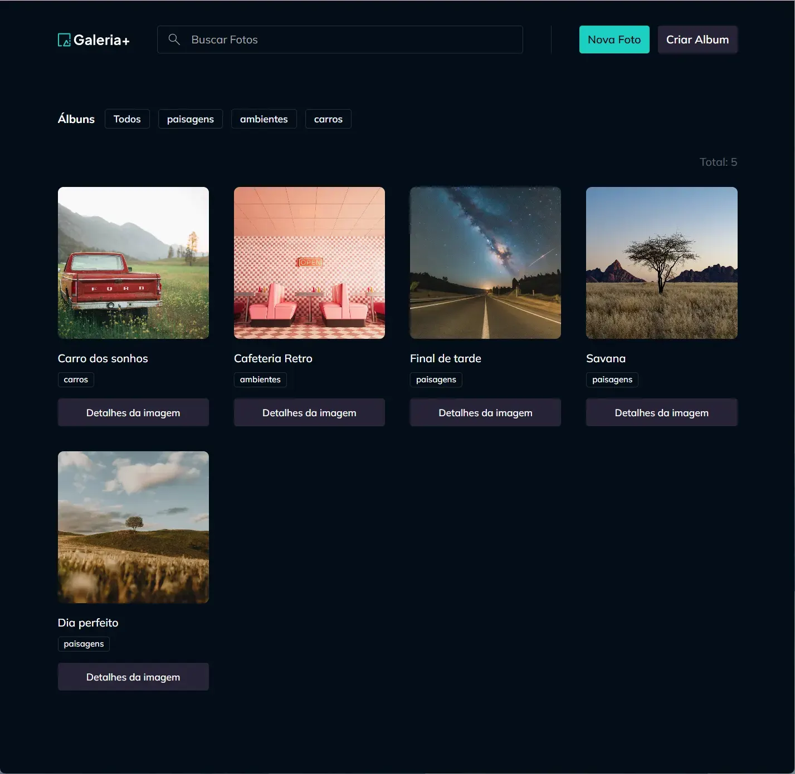
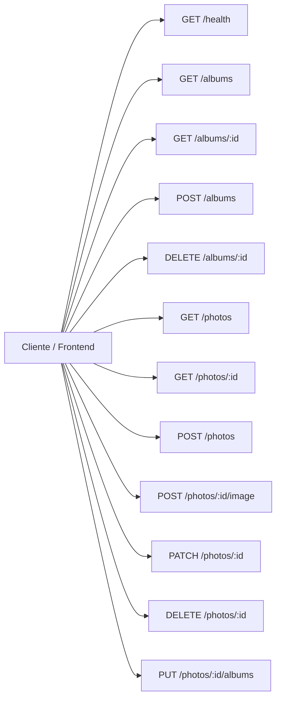

<div align="center">

# Photo Galleries


## </div>

## 📋 Menu

- 🖼️ [Imagem do Projeto](#imagem-do-projeto)
- 📖 [Sobre](#sobre)
- 🛠️ [Tecnologias](#tecnologias)
- ⚙️ [Funcionalidades](#funcionalidades)
- 🗂️ [Arquitetura de Dados](#arquitetura-de-dados)
- 📁 [Estrutura do Projeto](#estrutura-do-projeto)
- 🔐 [Variáveis de Ambiente](#variáveis-de-ambiente)
- 🚀 [Configuração](#configuração)
- 🗺️ [Rotas — Frontend](#rotas--frontend)
- 🗺️ [Rotas — API](#rotas--api)
- 👥 [Contributors](#contributors-or-owners)
- 🤝 [Contribuir](#contribute-to-the-projects-or-owner)
- 📬 [Contact](#contact)
- 📄 [License](#license)

## Imagem do Projeto



## Sobre

Photo Galleries é uma aplicação full-stack para organizar galerias de fotos com um fluxo simples de criação, busca, upload e associação a álbuns. A interface foi construída com React e Vite, enquanto a API utiliza Fastify para expor endpoints REST e servir imagens de forma estável.

| Item                | Detalhe                                                                 |
| ------------------- | ----------------------------------------------------------------------- |
| Tipo de repositório | Monorepo                                                                |
| Estrutura           | Turborepo-like com apps/web e apps/api em um mesmo workspace pnpm      |

Desenvolvido por **Emmanuel Oliveira**.

## Tecnologias

| Tecnologia | Versão | Descrição |
| ---------- | ------ | --------- |
| React | 19.1.0 | Biblioteca para construção da interface do usuário |
| TypeScript | 5.8.3 | Tipagem estática no frontend e no backend |
| Vite | 6.3.5 | Ferramenta de build e desenvolvimento para o frontend |
| React Router | 8.0.1 | Roteamento das páginas da aplicação |
| TanStack Query | 5.101.1 | Gerenciamento de requisições assíncronas e cache |
| Tailwind CSS | 4.1.10 | Estilização utilitária e responsiva |
| Radix UI | 1.1.17 | Componentes acessíveis como dialogs |
| Fastify | 4.24.3 | Framework HTTP para a API backend |
| Zod | 3.22.4 | Validação de schemas e dados de entrada |
| Node.js | 20+ | Runtime para execução do backend |

## Funcionalidades

- ✅ Criar, listar e remover álbuns
- ✅ Criar, editar, buscar e excluir fotos
- ✅ Fazer upload de imagens em formatos suportados
- ✅ Associar fotos a múltiplos álbuns
- ✅ Navegar entre fotos com detalhes, próxima/anterior e ações de exclusão
- ✅ Consultar a API para renderizar galerias e imagens em tempo real

## Arquitetura de Dados

A aplicação segue um fluxo simples de dados entre frontend e backend: a interface consome a API REST, o backend valida e persiste as informações em um arquivo JSON local e as imagens em pasta dedicada, enquanto o frontend organiza o estado com hooks e React Query.

### Banco de Dados

| Item | Valor |
| ---- | ----- |
| Banco | Arquivo JSON local em apps/api/data/db.json |
| Armazenamento de imagens | Diretório apps/api/data/images |
| Persistência | Escrita e leitura via serviços do backend |

### Componentes Principais

| Componente | Localização | Descrição |
| ---------- | ----------- | --------- |
| MainHeader | apps/web/src/components/main-header.tsx | Cabeçalho principal com busca, criação de foto e álbum |
| PhotosList | apps/web/src/contexts/photos/components/photos-list.tsx | Lista de fotos e filtros de exibição |
| PhotoDetails | apps/web/src/pages/page-photo-details.tsx | Página de detalhes da foto com upload e associação a álbuns |
| AlbumNewDialog | apps/web/src/contexts/albums/components/album-new-dialog.tsx | Modal para criar novos álbuns |
| PhotoNewDialog | apps/web/src/contexts/photos/components/photo-new-dialog.tsx | Modal para criar novas fotos |
| PhotosSearch | apps/web/src/components/photos-search.tsx | Campo de busca para encontrar fotos |
| AlbumsService | apps/api/albums/albums-service.ts | Lógica de negócio para manipulação dos álbuns |
| PhotosService | apps/api/photos/photos-service.ts | Lógica de negócio para fotos, uploads e vínculos com álbuns |

## Estrutura do Projeto

```text
photo-galleries/
├── apps/
│   ├── web/
│   │   ├── public/
│   │   ├── src/
│   │   │   ├── components/
│   │   │   ├── contexts/
│   │   │   ├── helpers/
│   │   │   ├── pages/
│   │   │   └── routes/
│   │   └── package.json
│   └── api/
│       ├── albums/
│       ├── data/
│       ├── photos/
│       ├── services/
│       ├── main.ts
│       └── package.json
├── packages/
├── package.json
├── pnpm-workspace.yaml
└── pnpm-lock.yaml
```

## Variáveis de Ambiente

Crie arquivos de ambiente conforme necessário para o frontend e o backend:

```env
# Frontend
VITE_API_URL=http://localhost:5799
VITE_IMAGES_URL=http://localhost:5799/images/

# Backend
PORT=5799
```

> ⚠️ Nunca versione o arquivo de ambiente. O projeto já utiliza valores locais para desenvolvimento.

## Configuração

### Pré-requisitos

- Node.js 20+
- pnpm

### Instalação

```bash
# Clone o repositório
git clone [repo-url]

# Instale as dependências (raiz do workspace)
pnpm install

# Execute o backend
pnpm --filter api dev

# Execute o frontend em outro terminal
pnpm --filter web dev
```

> ℹ️ Este projeto é um monorepo com frontend e backend separados em apps/web e apps/api. A instalação deve ser feita na raiz para que o pnpm workspace resolva as dependências corretamente.

### Scripts Disponíveis

| Script | Comando | Descrição |
| ------ | ------- | --------- |
| Desenvolvimento frontend | pnpm --filter web dev | Inicia o Vite com a interface da aplicação |
| Desenvolvimento backend | pnpm --filter api dev | Inicia a API Fastify |
| Lint | pnpm lint | Verifica o projeto com Biome |
| Formatação | pnpm format | Formata os arquivos do workspace |

## Rotas — Frontend

| Rota | Descrição |
| ---- | --------- |
| `/` | Página inicial com filtro de álbuns e lista de fotos |
| `/fotos/:id` | Página de detalhes da foto com navegação entre imagens |
| `/components` | Página de demonstração de componentes UI |

## Rotas — API

### Base URL

```text
http://localhost:5799
```



| Método | Rota | Descrição |
| ------ | ---- | --------- |
| `GET` | `/health` | Verifica se a API está no ar |
| `GET` | `/albums` | Lista os álbuns cadastrados |
| `GET` | `/albums/:id` | Busca um álbum específico |
| `POST` | `/albums` | Cria um novo álbum |
| `DELETE` | `/albums/:id` | Remove um álbum |
| `GET` | `/photos` | Lista fotos com filtro por álbum ou texto |
| `GET` | `/photos/:id` | Busca uma foto específica |
| `POST` | `/photos` | Cria uma foto |
| `POST` | `/photos/:id/image` | Faz upload de imagem para uma foto |
| `PATCH` | `/photos/:id` | Atualiza o título de uma foto |
| `DELETE` | `/photos/:id` | Remove uma foto |
| `PUT` | `/photos/:id/albums` | Atualiza a associação entre foto e álbuns |

## Contributors or owners


<br>

[Emmanuel Oliveira](https://www.linkedin.com/in/oliveira-emmanuel/)

<br>

<small>

[developed by 💖Emmanuel Oliveira](https://www.linkedin.com/in/oliveira-emmanuel/)

</small>

<br>

<small> &copy; Todos os Direitos Reservados </small>

## Contribute to the projects or Owner

Clique na seta abaixo e veja como você pode contribuir para o projeto

<details close>

<summary>
Como fazer uma contribuição ao Projeto ?
</summary>
Familiarize-se com a documentação do projeto, que geralmente inclui guias de instalação.

<br>

Explore o código do projeto para entender sua estrutura e funcionamento.

<br>

**Faça um Fork**

Crie uma cópia (fork) do repositório original em sua conta do GitHub.

<br>


<a href="https://docs.github.com/pt/pull-requests/collaborating-with-pull-requests/working-with-forks/fork-a-repo"></a>

**Clone o Repositório**

Isso criará uma cópia local do projeto, onde você poderá fazer suas modificações.


<a href="https://docs.github.com/pt/repositories/creating-and-managing-repositories/cloning-a-repository"></a>

**Crie uma Nova Branch:**

Crie uma nova branch para isolar suas alterações.

<br>

Isso facilita a organização do seu trabalho e a criação de pull requests.

<br>

**Faça as Alterações:**

Crie funcionalidades, mude estilos ou resolva bugs que contribuam para a melhoria do projeto.

<br>

**Crie um Pull Request:**

Inclua uma descrição clara das suas alterações e explique como elas resolvem o problema ou melhoram o projeto.

<br>

**Revise e Responda a Feedback:**

Colabore: os mantenedores podem solicitar alterações ou fornecer feedback sobre o seu código.

## </details>

## Contact

[](https://www.linkedin.com/in/oliveira-emmanuel/)
[](https://wa.me/5511968336094)
<a href="mailto:ofs.dev.br@gmail.com"> </a>

## <sub>😁Obrigado por chegar até aqui!<sub>

## License

<br>
Released in 2026. This project is under the **MIT license**.<br>

<br>
<div align="center">

<strong>⭐ Se este projeto foi útil para você, considere dar uma estrela!</strong>

</div>
